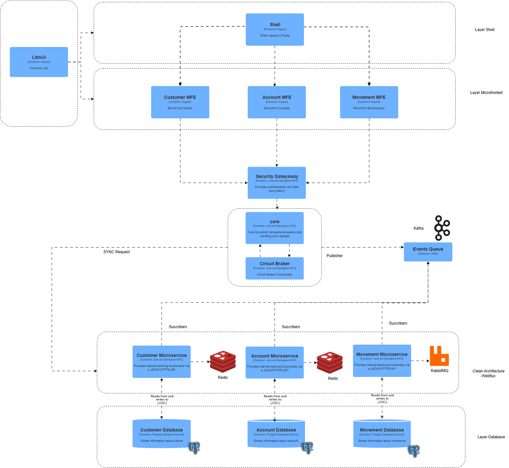
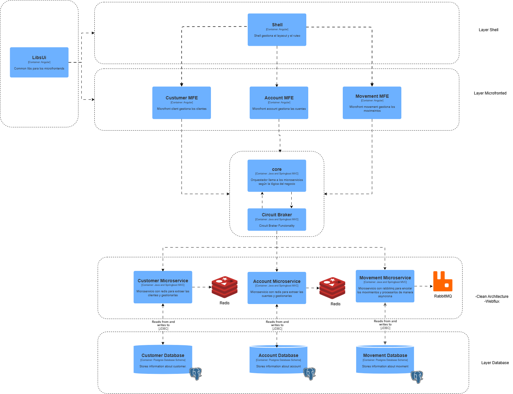
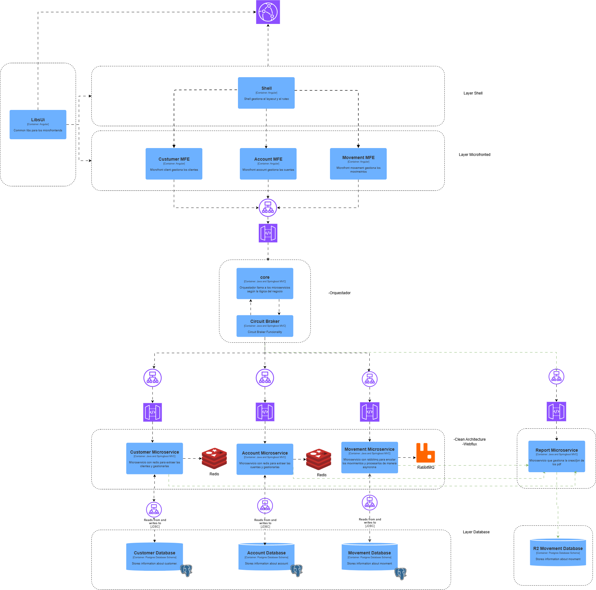

# Evaluación SSWE - Sistema Bancario con Microservicios

**Desarrollado por:** Christian Guerrero García  
**Fecha:** Septiembre 2025  
**Tecnologías:** Spring Boot Webflux, Angular, Docker, Module Federation, OpenApi

---

## 📋 Descripción del Proyecto

Sistema bancario distribuido implementado con arquitectura de microservicios, utilizando Angular con Module Federation para el frontend y Spring Boot para los servicios backend.

## 🏗️ Arquitectura del Sistema

### Arquitectura Objetivo


### Arquitectura Propuesta


### Arquitectura Propuesta e Infraestructura

## 🔧 Componentes del Sistema

### Microservicios
```
1.- Customer Microservice
2.- Account Microservice
3.- Movement Microservice 
4.- Report Microservice
```

### Database
```
1.- Customer Database
2.- Account Database
3.- Movement - Report Database
```

### Core Orchestrator
```
1.- ocore Orchestrator
```

### Shell & Microfronend
```
1.- Shell
2.- Customer MFE
3.- Account MFE
4.- Movement MFE
```

### Build and Run Project
```
Create Network for Microservice, Db, Frontend (Comunication)
docker network create bcpc


Docker Account MicroService

docker build . -t account-image:1.0.0
docker run -d  --name account-msa --network=ncore -p 8080:8080 account-image:1.0.0

Docker Movement MicroService
docker build . -t movement-image:1.0.0
docker run -d --name movement-msa --network=ncore -p 8082:8082 movement-image:1.0.0

Docker Customer MicroService
docker build . -t customer-image:1.0.0
docker run -d --name customer-msa --network=ncore -p 8081:8081 customer-image:1.0.0

Docker Orchestrator Middleware
docker run -d --name orchestrator-core-ms --network=ncore -p 8085:8085 ocore-image:1.0.0

Shell
docker build . -t shell-image:1.0.0
docker run -d  --name shell-core --network=ncore -p 4200:4200 shell-image:1.0.0 

Microfrontend
docker build . -t account-image:1.0.0
docker run -d  --name account-mfe --network=ncore -p 4202:4202 account-image:1.0.0 

Microfrontend
docker build . -t clients-image:1.0.0
docker run -d  --name clients-mfe --network=ncore -p 4201:4201 clients-image:1.0.0 

Microfrontend
docker build . -t movements-image:1.0.0
docker run -d  --name movements-mfe --network=ncore -p 4203:4203 movements-image:1.0.0 

```
### Script DB and Docker Compose
```
Go to database
docker-compose up --build -d
```
